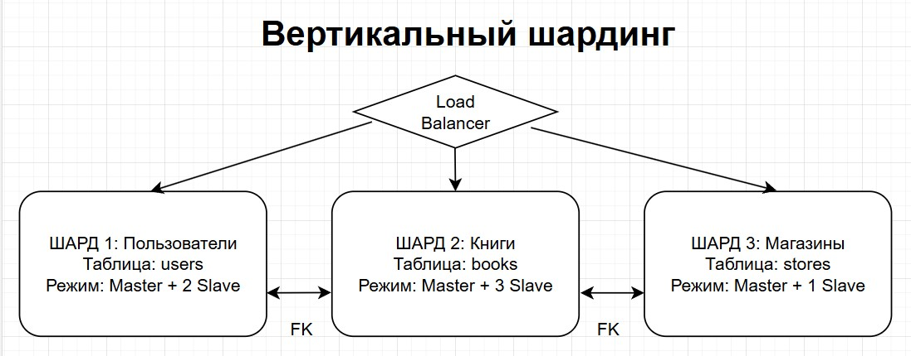
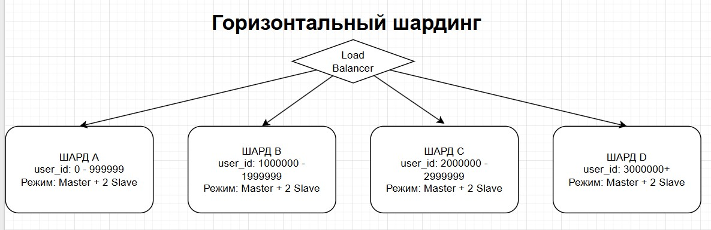

### Домашнее задание «Репликация и масштабирование. Часть 2» - Князев Евгений

# Задание 1.
Опишите основные преимущества использования масштабирования методами:
- активный master-сервер и пассивный репликационный slave-сервер;
- master-сервер и несколько slave-серверов;

Метод активный master-сервер и пассивный репликационный slave-сервер имеет следующие преимущеста: легкость поддержки, т.к. обладает минимальной конфигурацией, высокая доступность - при падении master можно быстро переключиться на slave, удобен для резервного копирования - копии можно снимать со slave, не нагружая и не останавливая master.

Метод master-сервер и несколько slave-серверов имеет следующие преимущеста: масштабирование чтения - SELECT распределяются между несколькими slave, географическое распределение - сервера можно устанавливать ближе к конечным пользователям, разделение типов серверов - один сервер используется для резервного копирования, второй для тестирования, третий для оперативной работы и т.д.

# Задание 2.
Разработайте план для выполнения горизонтального и вертикального шаринга базы данных. База данных состоит из трёх таблиц:
- пользователи,
- книги,
- магазины (столбцы произвольно).
Опишите принципы построения системы и их разграничение или разбивку между базами данных.

Пришлите блоксхему, где и что будет располагаться. Опишите, в каких режимах будут работать сервера.

**ВЕРТИКАЛЬНЫЙ ШАРДИНГ** 

Разделение на шарды происходит таблицам (пользователи, книги, магазины) — каждая таблица размещается в отдельной базе данных, а не по строкам. Связи между таблицами осуществляются через внешние ключи - FK.

Режим работы серверов: 
Шард 1 (users) - режим работы master + 2 slave. Такой режим выбран для реализации резервного копирования и отказоустойчивости. 
Шард 2 (books) - режим работы master + 3 slave. Планируется, что на этот шард будет максимальная нагрузка на чтение (SELECT), поэтому он имеет 3 slave. 
Шард 3 (stores) - режим работы master + 1 slave. Минимальная конфигурация, т.к. на этот шард будет самая маленкая нагрузка.

**ГОРИЗОНТАЛЬНЫЙ ШАРДИНГ**

Разделение на шарды происходит по строкам — одна таблица разбивается на части по диапазонам ключа user_id.

Шард А: user_id от 0 до 999999 
Шард B: user_id от 1000000 до 1999999 
Шард C: user_id от 2000000 до 2999999 
Шард D: user_id более 3000000 

Режим работы серверов: 
Для всех шардов выбрана единая схема: master + 2 slave для реализации резервного копирования и отказоустойчивости.